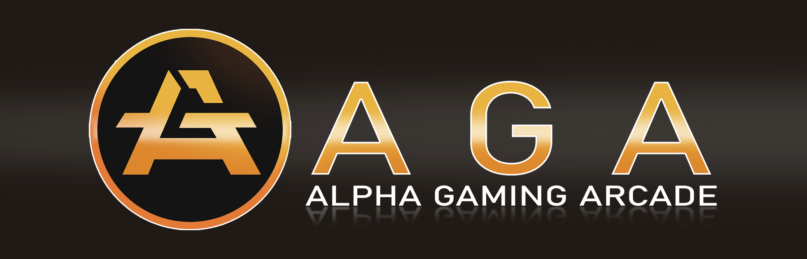

# [AGA](https://aga.network)

  
  

## Introduction

- **AGA: Seamless Asset Transfers Across Games**

  At the core of our blockchain lies **AGA**, a revolutionary system designed to enable seamless asset transfers between different games. Whether you’re moving items, characters, or currencies, AGA ensures a secure and frictionless experience for players and developers alike.

- **Game Asset Portability**

  AGA utilizes cutting-edge blockchain technology to facilitate decentralized storage and verification of game assets. By implementing a robust Proof of Authority (PoA) consensus mechanism and leveraging a cross-chain bridge, AGA ensures that assets remain secure, immutable, and auditable, empowering players to truly own their digital possessions.

- **Interoperability and Integration**

  Built with a focus on flexibility, AGA offers compatibility with EVM-compatible chains and other ecosystems. This cross-chain functionality, powered by the cross-chain bridge, allows game developers to integrate their titles effortlessly, while players can enjoy a unified experience across multiple games.

- **Player-Centric Economy**

  AGA opens the door to new economic opportunities by enabling a player-driven marketplace for in-game assets. Players can trade, sell, and purchase assets transparently, while developers benefit from increased engagement and monetization avenues.

- **Developer-Friendly Framework**

  AGA provides an intuitive platform with tools and SDKs designed for game developers to easily onboard and integrate asset transfer functionalities. The streamlined process reduces development overhead and fosters innovation within the gaming industry.

## Release

### Testnet (Pioneer Phase)

Experience the capabilities of AGA through our Pioneer Testnet. Test asset transfers, explore cross-game compatibility, and provide valuable feedback to shape the future of the platform. Join the community of developers and players pioneering this new era of gaming interoperability.

### Mainnet

The Mainnet launch is on the horizon. Stay connected for updates and announcements as we bring AGA to life and redefine the gaming experience.

### Tags and Runtime Versions

Each release tag includes the different versions of the runtimes corresponding to on-chain upgrades. This ensures that all changes and updates to the Allfeat network and runtime environments are fully traceable and easy to follow.

## Documentation

- [Allfeat Docs](https://docs.aga.com)
- 
## Quick Setup

## Contribution

AGA is open-source under the GPLv3 license. We welcome community contributions. Please review [CONTRIBUTIONS.md](doc/CONTRIBUTIONS.md) for details on how to contribute to the project.
